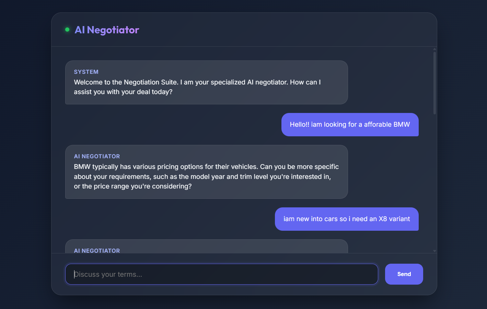

# 🤝 AI Negotiation Chatbot

A premium, AI-powered negotiation platform that uses **Llama 3.1 (via Groq)** to simulate professional business negotiations. Featuring a stunning modern UI and intelligent conversation memory, this chatbot is designed to help users refine their bargaining skills.



## ✨ Features

- **Professional Negotiator Persona**: Customized AI prompt that acts as a firm, polite, and precise business negotiator.
- **Intelligent Memory**: The chatbot maintains context throughout the session, allowing for complex multi-turn negotiations.
- **Premium UI/UX**:
    - Modern **Glassmorphism** aesthetic.
    - Responsive design for Desktop and Mobile.
    - Smooth message animations and typing indicators.
    - "Enter" key support for seamless chatting.
- **Hybrid Platform**: Includes both a **Web Chat Interface** (Flask) and a **CLI Match Simulator** for agent-to-agent negotiations.

## 🛠️ Technology Stack

- **Backend**: Python, Flask
- **AI Model**: Llama 3.1 8B (Powered by [Groq](https://groq.com/))
- **Frontend**: Vanilla JS, Modern CSS (Glassmorphism), Google Fonts (Outfit & Inter)
- **Environment**: Dotenv for secure API management

## 🚀 Quick Start

### 1. Clone the Repository
```bash
git clone https://github.com/sarath-spidey/AI-negotiation-chatbot.git
cd AI-negotiation-chatbot
```

### 2. Install Dependencies
```bash
pip install -r requirements.txt
```

### 3. Set Up Environment Variables
Create a file named `.env` in the root directory and add your Groq API key:
```env
GROQ_API_KEY=your_actual_api_key_here
```

### 4. Run the Application

#### **To Start the Web Server:**
```bash
python app.py
```
Visit `http://127.0.0.1:5000` in your browser.

#### **To Run a CLI AI-vs-AI Match:**
```bash
python run_match.py
```

## 🔒 Security
The project is configured with a `.gitignore` to ensure that your `.env` file and sensitive API keys are never uploaded to version control.

## 📄 License
Distributed under the MIT License. See `LICENSE` for more information.

---
*Created by [Sarath Spidey](https://github.com/sarath-spidey)*
